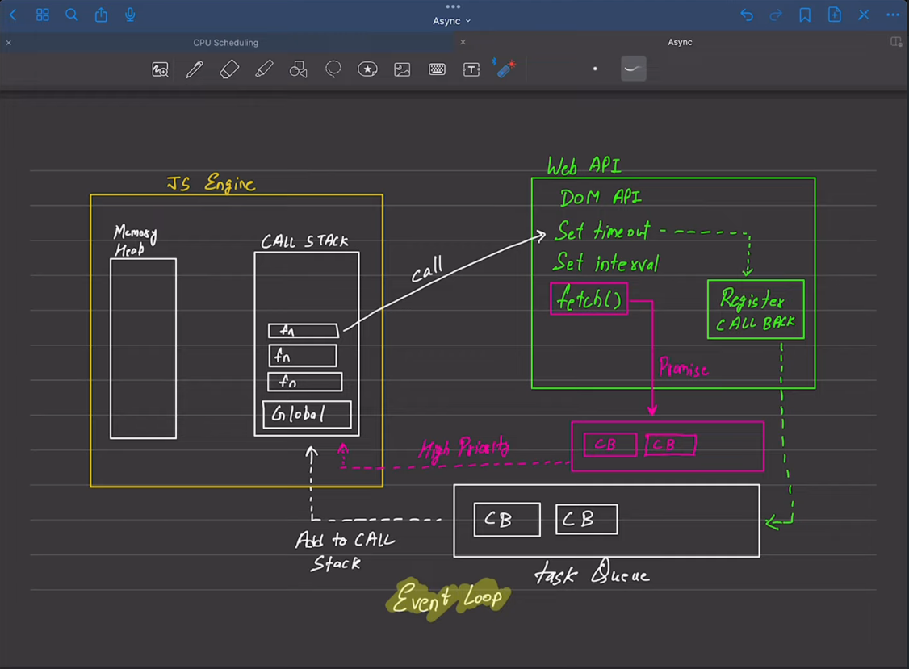

# Notes on Async
## Vanilla JavaScript
**JS is Asynchronous but it's default behavior is Synchronous.**

**Synchronous & Single Threaded:** Each operation waits for the last one to complete executing.

## Blocking and Non-blocking Code
**Blocking(Synchronous):**
- Blocks the flow of the Program.
- Read file Sync.

**Non-blocking Code (Asynchronous)**
- Does not block the flow of the Program.
- Read file Async.

## Alone JavaScript Engine - Event Loop

**1:** Task Queue is used to configure Async functionality. 

**2:** Register CallBack is used to define functions to Task Queue.

**3:** `setInterval[0]` and `setTimeout[0]` are executed after everything else is already executed in the call stack.

